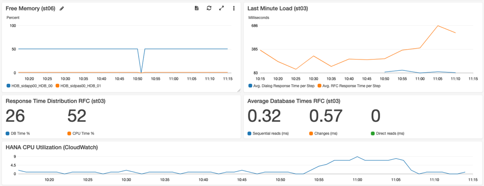

# Overview

Amazon CloudWatch Monitoring for SAP Netweaver ABAP based environments powered by AWS Lambda.

Please see our blog post [SAP Monitoring: A serverless approach using Amazon CloudWatch](https://amazon.awsapps.com/workdocs/index.html#/document/151c381cb0ac16d54cc0b5b5c42a0cb78558a42fd8d32515b82223bd67aecd34) for more info on the motivation and concept!

## Prerequisites

- SAP NetWeaver ABAP 7.4 or higher (ECC, S4, BW, ...), running on AWS
  - SAP Component ST-PI Release 740 SP 08 or higher (due to usage of [/SDF/SMON](https://wiki.scn.sap.com/wiki/display/CPP/All+about+SMON))
  - SAP Statistical Records enabled (TCODE stad/st03), usually by default, if not check SAP Note [2369736](https://launchpad.support.sap.com/#/notes/0002369736).
  - SAP RFC User & PW with authorizations - see "How to -> Step 1"
- SAP S-User to download SAP JCo – see “How to -> Step 2”
- Existing AWS VPC & Security Group(s), so that AWS Lambda function can be deployed and establish network connectivity towards the SAP system to be monitored (usually port 33\<INSTANCEID\>).
-	Amazon CloudWatch Detailed Monitoring enabled (1 min granularity). Optional for non-Prod, required for Prod as per SAP Note [1656250](https://launchpad.support.sap.com/#/notes/1656250).

## Setup

Please follow the [step-by-step guide](docs/0_How_to_setup.md).

## Architecture

**Note:** You will have to deploy a single instance of this application per SAP System ID!

## Output

## Captured Metrics

**Note:** This section is continously updated!

**Generic (2 - per SID):**  
"PING" = SAP Monitor RFC Execution Time  
"UPTIME" = SAP Monitor Status  

**[/SDF/SMON](https://wiki.scn.sap.com/wiki/display/CPP/All+about+SMON) (14 - per Instance), granularity 1 min:**  
"ACT_WPS" = Number of Active Work Processes  
"ACT_DIA" = Number of Active Dialog Work Processes  
"TRFC_FREE" = Number of Available Work Processes for RFCs  
"SESSIONS" = Number of Sessions  
"USERS" = Number of Logins  
"UPDQ" = Update Queue Length  
"ENQQ" = Enqueue Queue Length  
"DIAQ" = Dialog Queue Length  
"PRIVWPNO" = Number of Work Processes in Priv Modes  
"DIAAVG20" = Average Load last 20s  
"DIAAVG60" = Average Load last 60s  
"FREE_MEM_PERC" = Free Memory in % of RAM  
"USR_TOTAL" = CPU Utilization (User) in %  
"SYS_TOTAL" = CPU Utilization (System) in %  

**SWNC_GET_WORKLOAD_SNAPSHOT = [st03](https://wiki.scn.sap.com/wiki/pages/viewpage.action?pageId=471174735) Last Minute Load (12 - per SID), granularity 5 min**  

Currently enabled for Tasktypes DIA & RFC:

"ST03_<TYPE>_AVG_SNAP" = Average Response Time per Step in ms (ideally < 1s)  
"ST03_<TYPE>_CPU_TIME_PERC_SNAP" = Average CPU Time in % as part of average response time (ideally ca. 40%)  
"ST03_<TYPE>_DB_TIME_PERC_SNAP" = Average DB Time in % as part of average response time (ideally ca. 40%)  
"ST03_<TYPE>_AVG_DB_DIR_SNAP" = Average Database Request Time per Direct reads in ms (ideally max. 10ms)  
"ST03_<TYPE>_AVG_DB_SEQ_AVG_SNAP" = Average Database Request Time per Sequential reads in ms (ideally max. 10ms)  
"ST03_<TYPE>_AVG_DB_CHG_AVG_SNAP" = Average Database Request Time per Changes in ms (ideally max. 10ms)  
  
  
**Note:** Further Metrics such as SAP HANA Data/Log Disk Space, Free Memory could be captured via the [CloudWatch Agent](https://docs.aws.amazon.com/AmazonCloudWatch/latest/monitoring/Install-CloudWatch-Agent.html).

## Further Considerations

- [Cost](docs/Cost_Considerations.md)  
- [Performance & Overhead](docs/Performance_Considerations.md)  

## Further Ideas

- Add further metrics
  - Number of Dumps (st22)
  - Number of critical syslog issues (sm21)
  - Number of failed/pending IDOCs (we02)
  - Number of aborted/failed jobs (se37)
  - Odata Statistics
  - Business Metrics e.g. Open Sales Orders
  - st03 other tasktypes
- Add "SIDs" as dimensions for quicker search
- Allow to include/exclude metrics

## License

This project is licensed under the Apache-2.0 License.

This solution requires the [SAP Java Connector](https://support.sap.com/en/product/connectors.html) from SAP SE to be added manually.
  
All rights reserved.